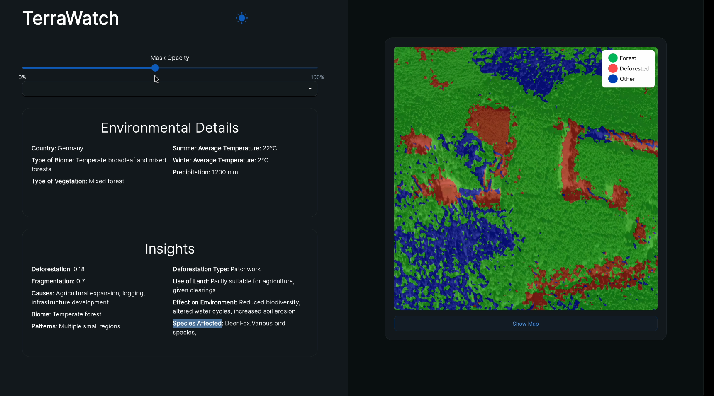

# TerraWatch: Deforestation Detection and Analysis Using Image Segmentation and Multimodal LLMs

## Concept

TerraWatch is a proof of concept system developed during the TUM AI Hackathon 2024 to detect deforestation from satellite images and reason out the causes and potential environmental effects using computer vision models and multimodal large language models.


<p align="center">
  
</p>

**Link to Full Video Demo:** [Link](./assets/demo_video.mov)


## Architecture


## Frontend

setup dependencies

```bash 
npm install
```

run frontend on localhost

```bash
npm start
```

## Running the LLM

1. Get the API keys! Put them in `.env` (don't worry, it's `gitignore`d).

2. Create a virtual environment (I use `virtualenv`).
```bash
python -m virtualenv tumai
source tumai/bin/activate
```

3. Inside the environment, run:
```bash
pip install -r requirements.txt
```
The dependencies are installed. 

4. To start the server, run
```bash
python -m uvicorn llm:app --reload
```

5. The API is now accessible through
```url
http://localhost:8000/lat_long/{latitude}/{longitude}
http://localhost:8000/post_test
```

Your `POST` request should look something like this:
```python
@app.get("/post_test")
def post_test():
    url = 'http://127.0.0.1:8000/upload'
    file = {'image': open('./example_image.png', 'rb'),
            'mask': open('./example_mask.png', 'rb'),
        }
    response = requests.post(url=url, files=file)
    result = json.loads(response.json())
    return result
```